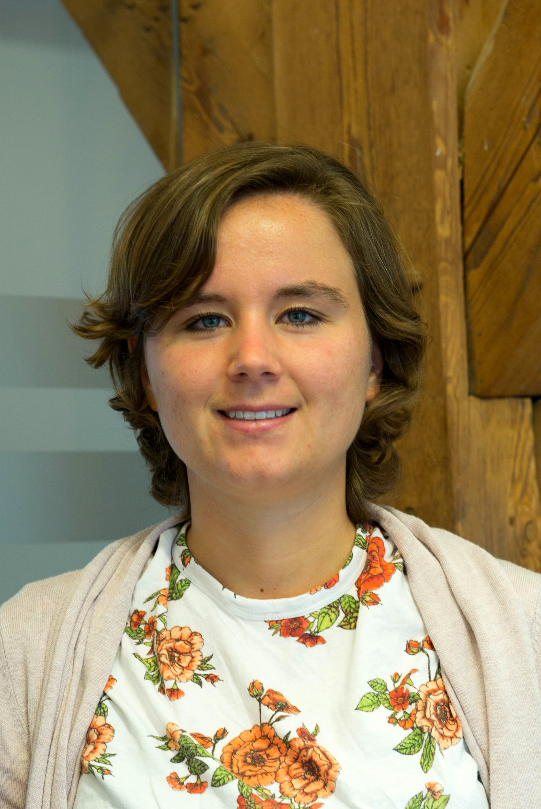
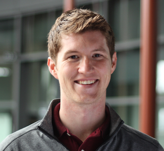

Title: Special Session WeRob 2020
Date: 2020-06-10 20:30
Category: WeRob2020
url: 
save_as: index.html

WeR10: Musculoskeletal modelling to evaluate and optimize performance of wearable robotic devices

Organizers: Maarten Afschrift, Friedl De Groote, Sam van Rossom

## Abstract:

Our poor understanding of how wearable robotics influence the underlying physiology and musculoskeletal mechanics of the user limits optimal design. One of the main problems is that multiple important evaluation criteria, such as joint loading and muscle energetics, cannot easily be measured experimentally. Therefore, we are restricted to crude evaluation measures which limit the current understanding. Musculoskeletal modelling enables the estimation of evaluation criteria that are difficult to measure using mathematical modelling and simulation. This facilitates a more in-depth evaluation of device performance and can provide more insight in the interaction between wearable robotic devices and human physiology. Furthermore, musculoskeletal modelling has the potential to further optimize the design and control of wearable robotic devices in simulations. However, this method requires accurate models of the human neuromusculoskeletal system as well as its interaction with the wearable robotic devices. In this session, we will discuss the current state-of-the-art in musculoskeletal modelling techniques to evaluate and optimize the performance of wearable robotic devices. 

## Invited speakers

### Anne Koelewijn

**Title: Investigating Energy Optimization in Walking Using Predictive Musculoskeletal Simulations**

 

Anne Koelewijn is an assistant professor at Friedrich-Alexander-Universität (FAU) Erlangen-Nürnberg since August 2019. At FAU, she leads the biomechanical motion analysis and creation (BioMAC) group in the Machine Learning and Data Analytics (MaD) lab. The BioMAC group aims to better understand human motion, and design better wearables, like exoskeletons and prostheses, using simulation of human movements. Previously, she was a postdoc in BIOROB at EPFL (2018-2019), and she received a doctorate in mechanical engineering from Cleveland State University (2018). During her doctorate, she researched predictive gait simulations and their application in understanding gait of persons with a lower-leg prosthesis.

### Nick Bianco

 

Nick Bianco is PhD candidate in the Neuromuscular Biomechanics Lab at Stanford University under the direction of Dr. Scott Delp. His doctoral research is focused on the design of wearable robotic exoskeletons that reduce the metabolic cost of walking using musculoskeletal simulation. He is also a core developer on the OpenSim Moco project, which provides powerful direct collocation optimal control tools compatible with the OpenSim modeling software package. 

**Title: Musculoskeletal simulations reveal the metabolic benefits of exoskeleton assistance strategies that couple multiple degrees-of-freedom**

### Richard Nuckols

**Ultrasound imaging of plantarflexor muscles: Effects of ankle exoskeleton assistance on muscle-tendon dynamics during walking and application towards improved exosuit control**

### Ali Tabasi

**Effects of different control strategies of a back-support exoskeleton on the torque actively generated by back-extensors**

